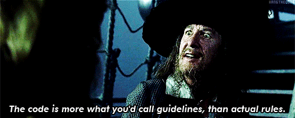

Pirate RPC
=============

Pirate RPC is a framework for implementing session-oriented remote procedure APIs. It is very well suited for building service-to-service WebSocket interfaces, but really doesn't care that much. Pirate uses a [Driver interface] to abstract protocol-specific interfaces out of its internals.



[Detailed documentation is available on the repository's GitHub Pages site](https://jmanero.github.io/pirate-rpc)

### Adding Documentation Pages

Add markdown files to `docs/_pages`. Files must have a `frontmatter` header with, at least, the following attributes:

```
---
layout: default
title: Documentation
icon: tags
order: 200
---
```

* `icon` is the [Font Awesome] icon that will be used in the generated navigation pane
* `order` defines the sorting behavior of pages in the generated navigation pane

Pages are rendered by Jekyll and can include [Liquid template] tags and filters.

[Driver interface]: https://jmanero.github.io/pirate-rpc/pages/drivers.html
[Font Awesome]: http://fontawesome.io/icons/
[Liquid template]: https://jekyllrb.com/docs/templates/
